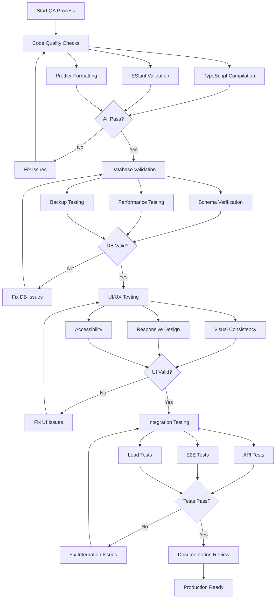

# Design Document

## Overview

This design outlines the comprehensive approach for final system integration testing, code validation, and quality assurance for the Saudi Mais Medical Inventory System. The design follows a systematic, multi-phase approach to ensure production readiness through automated testing, manual verification, performance optimization, and complete documentation.

## Architecture

### Testing Architecture

```
┌─────────────────────────────────────────────────────────────┐
│                    QA & Integration Layer                    │
├─────────────────────────────────────────────────────────────┤
│                                                               │
│  ┌──────────────┐  ┌──────────────┐  ┌──────────────┐      │
│  │   Unit Tests │  │ Integration  │  │  E2E Tests   │      │
│  │   (Vitest)   │  │    Tests     │  │ (Playwright) │      │
│  └──────────────┘  └──────────────┘  └──────────────┘      │
│                                                               │
│  ┌──────────────┐  ┌──────────────┐  ┌──────────────┐      │
│  │ Performance  │  │  Security    │  │ Accessibility│      │
│  │  (Lighthouse)│  │   Audits     │  │   (axe-core) │      │
│  └──────────────┘  └──────────────┘  └──────────────┘      │
│                                                               │
└─────────────────────────────────────────────────────────────┘
                            │
                            ▼
┌─────────────────────────────────────────────────────────────┐
│                   Application Layer                          │
│  (Next.js 15, TypeScript, Prisma, NextAuth, Gemini AI)     │
└─────────────────────────────────────────────────────────────┘
```

### Quality Assurance Workflow



## Components and Interfaces

### 1. Testing Infrastructure

#### Test Suites Structure


```
/tests
├── unit/                          # Unit tests for utilities and services
│   ├── validators.test.ts         # Zod schema validation tests
│   ├── formatters.test.ts         # Date/number formatting tests
│   ├── utils.test.ts              # Utility function tests
│   └── services/
│       ├── auth.test.ts           # Auth service tests
│       ├── gemini.test.ts         # AI service tests
│       └── email.test.ts          # Email service tests
│
├── integration/                   # Integration tests
│   ├── api/
│   │   ├── auth.test.ts          # Auth API endpoint tests
│   │   ├── inventory.test.ts     # Inventory API tests
│   │   ├── analytics.test.ts     # Analytics API tests
│   │   └── reports.test.ts       # Reports API tests
│   ├── navigation-flow.test.ts   # Page navigation tests
│   └── data-flow.test.ts         # Data consistency tests
│
├── e2e/                           # End-to-end tests (Playwright)
│   ├── auth-flow.spec.ts         # Complete auth workflows
│   ├── data-entry.spec.ts        # Data entry workflows
│   ├── analytics.spec.ts         # Analytics workflows
│   └── admin.spec.ts             # Admin workflows
│
├── load/                          # Load testing (Artillery)
│   └── api-load-test.yml         # API load test scenarios
│
└── helpers/                       # Test utilities
    ├── setup.ts                   # Test environment setup
    ├── fixtures.ts                # Test data fixtures
    └── mocks.ts                   # Mock services
```

#### Testing Tools Configuration

**Vitest Configuration** (`vitest.config.ts`):
```typescript
import { defineConfig } from 'vitest/config';
import react from '@vitejs/plugin-react';
import path from 'path';

export default defineConfig({
  plugins: [react()],
  test: {
    environment: 'jsdom',
    setupFiles: ['./tests/helpers/setup.ts'],
    coverage: {
      provider: 'v8',
      reporter: ['text', 'json', 'html'],
      exclude: [
        'node_modules/',
        'tests/',
        '**/*.config.ts',
        '**/*.d.ts',
      ],
      thresholds: {
        lines: 80,
        functions: 80,
        branches: 80,
        statements: 80,
      },
    },
  },
  resolve: {
    alias: {
      '@': path.resolve(__dirname, './src'),
    },
  },
});
```

**Playwright Configuration** (`playwright.config.ts`):
```typescript
import { defineConfig, devices } from '@playwright/test';

export default defineConfig({
  testDir: './tests/e2e',
  fullyParallel: true,
  forbidOnly: !!process.env.CI,
  retries: process.env.CI ? 2 : 0,
  workers: process.env.CI ? 1 : undefined,
  reporter: [
    ['html'],
    ['json', { outputFile: 'test-results/results.json' }],
  ],
  use: {
    baseURL: 'http://localhost:3000',
    trace: 'on-first-retry',
    screenshot: 'only-on-failure',
    video: 'retain-on-failure',
  },
  projects: [
    { name: 'chromium', use: { ...devices['Desktop Chrome'] } },
    { name: 'firefox', use: { ...devices['Desktop Firefox'] } },
    { name: 'webkit', use: { ...devices['Desktop Safari'] } },
    { name: 'mobile-chrome', use: { ...devices['Pixel 5'] } },
    { name: 'mobile-safari', use: { ...devices['iPhone 12'] } },
  ],
  webServer: {
    command: 'npm run dev',
    url: 'http://localhost:3000',
    reuseExistingServer: !process.env.CI,
  },
});
```

### 2. Database Validation System

#### Database Validation Script

**Purpose**: Verify database schema, relationships, indexes, and data integrity.

**Key Components**:
- Table existence verification
- Relationship validation
- Index presence checking
- Data integrity constraints
- Performance benchmarking

**Implementation** (`/scripts/validate-database.ts`):
```typescript
interface ValidationResult {
  category: string;
  status: 'pass' | 'fail' | 'warning';
  message: string;
  details?: any;
}

class DatabaseValidator {
  private results: ValidationResult[] = [];
  
  async validateTables(): Promise<void> {
    // Check all required tables exist
  }
  
  async validateRelationships(): Promise<void> {
    // Verify foreign key relationships
  }
  
  async validateIndexes(): Promise<void> {
    // Check performance indexes
  }
  
  async validateDataIntegrity(): Promise<void> {
    // Check constraints and data validity
  }
  
  async generateReport(): Promise<string> {
    // Generate validation report
  }
}
```

#### Query Performance Analyzer

**Purpose**: Identify slow queries and optimization opportunities.

**Metrics Tracked**:
- Query execution time (p50, p95, p99)
- Number of rows scanned
- Index usage
- N+1 query detection

### 3. Code Quality Tools

#### TypeScript Strict Mode Configuration

**tsconfig.json enhancements**:
```json
{
  "compilerOptions": {
    "strict": true,
    "noUncheckedIndexedAccess": true,
    "noImplicitOverride": true,
    "noUnusedLocals": true,
    "noUnusedParameters": true,
    "noFallthroughCasesInSwitch": true,
    "noImplicitReturns": true,
    "forceConsistentCasingInFileNames": true
  }
}
```

#### ESLint Configuration

**Enhanced rules for production**:
```json
{
  "rules": {
    "@typescript-eslint/no-explicit-any": "error",
    "@typescript-eslint/explicit-function-return-type": "warn",
    "@typescript-eslint/no-unused-vars": ["error", {
      "argsIgnorePattern": "^_",
      "varsIgnorePattern": "^_"
    }],
    "no-console": ["warn", { "allow": ["warn", "error"] }],
    "prefer-const": "error",
    "no-var": "error"
  }
}
```

### 4. Performance Monitoring

#### Lighthouse CI Integration

**Configuration** (`.lighthouserc.json`):
```json
{
  "ci": {
    "collect": {
      "numberOfRuns": 3,
      "settings": {
        "preset": "desktop"
      }
    },
    "assert": {
      "assertions": {
        "categories:performance": ["error", {"minScore": 0.9}],
        "categories:accessibility": ["error", {"minScore": 0.9}],
        "categories:best-practices": ["error", {"minScore": 0.9}],
        "categories:seo": ["error", {"minScore": 0.9}]
      }
    }
  }
}
```

#### Performance Metrics Collection

**Key Metrics**:
- First Contentful Paint (FCP) < 1.8s
- Largest Contentful Paint (LCP) < 2.5s
- Time to Interactive (TTI) < 3.8s
- Total Blocking Time (TBT) < 200ms
- Cumulative Layout Shift (CLS) < 0.1

### 5. Security Audit System

#### Security Checklist Automation

**Automated Checks**:
```typescript
interface SecurityCheck {
  name: string;
  category: 'auth' | 'api' | 'data' | 'frontend';
  check: () => Promise<boolean>;
  severity: 'critical' | 'high' | 'medium' | 'low';
}

const securityChecks: SecurityCheck[] = [
  {
    name: 'Password Hashing',
    category: 'auth',
    check: async () => {
      // Verify bcrypt with 12+ rounds
    },
    severity: 'critical',
  },
  {
    name: 'SQL Injection Prevention',
    category: 'api',
    check: async () => {
      // Verify Prisma parameterized queries
    },
    severity: 'critical',
  },
  // ... more checks
];
```

#### Security Headers Verification

**Required Headers**:
- `X-Content-Type-Options: nosniff`
- `X-Frame-Options: DENY`
- `X-XSS-Protection: 1; mode=block`
- `Referrer-Policy: strict-origin-when-cross-origin`
- `Content-Security-Policy: [detailed policy]`
- `Permissions-Policy: camera=(), microphone=(), geolocation=()`

### 6. Accessibility Testing

#### Automated Accessibility Testing

**Tools**:
- axe-core for automated WCAG checks
- Playwright accessibility snapshots
- Manual screen reader testing

**Implementation**:
```typescript
import { test, expect } from '@playwright/test';
import AxeBuilder from '@axe-core/playwright';

test('should not have accessibility violations', async ({ page }) => {
  await page.goto('/dashboard');
  
  const accessibilityScanResults = await new AxeBuilder({ page })
    .withTags(['wcag2a', 'wcag2aa', 'wcag21a', 'wcag21aa'])
    .analyze();
  
  expect(accessibilityScanResults.violations).toEqual([]);
});
```

#### Manual Accessibility Checklist

**Keyboard Navigation**:
- Tab order logical
- All interactive elements reachable
- Focus indicators visible
- No keyboard traps

**Screen Reader**:
- Page titles descriptive
- Headings hierarchical
- Form labels associated
- Error messages announced
- Loading states announced

### 7. Internationalization Validation

#### Translation Verification Script

**Purpose**: Ensure 100% translation coverage and detect untranslated content.

```typescript
interface TranslationReport {
  missingInArabic: string[];
  missingInEnglish: string[];
  suspiciousTranslations: Array<{
    key: string;
    value: string;
    reason: string;
  }>;
  coverage: number;
}

class TranslationValidator {
  async validate(): Promise<TranslationReport> {
    const enTranslations = await this.loadTranslations('en');
    const arTranslations = await this.loadTranslations('ar');
    
    // Compare keys
    // Check for untranslated values
    // Calculate coverage
    
    return report;
  }
}
```

#### RTL Layout Verification

**Automated Checks**:
- Text alignment (right in Arabic)
- Icon mirroring (arrows, chevrons)
- Padding/margin reversal
- Sidebar positioning
- Form field order

### 8. Load Testing Strategy

#### Artillery Configuration

**Test Scenarios**:
1. **Warm-up Phase**: 10 users/second for 60 seconds
2. **Sustained Load**: 50 users/second for 120 seconds
3. **Spike Test**: 100 users/second for 60 seconds

**Monitored Metrics**:
- Response time (p50, p95, p99)
- Error rate
- Requests per second
- Concurrent connections

**Acceptance Criteria**:
- p95 response time < 500ms
- p99 response time < 1000ms
- Error rate < 1%
- No memory leaks
- Database connections stable

## Data Models

### Test Result Schema

```typescript
interface TestResult {
  id: string;
  testSuite: string;
  testName: string;
  status: 'passed' | 'failed' | 'skipped';
  duration: number;
  error?: {
    message: string;
    stack: string;
  };
  timestamp: Date;
}

interface QAReport {
  id: string;
  runDate: Date;
  environment: 'development' | 'staging' | 'production';
  summary: {
    total: number;
    passed: number;
    failed: number;
    skipped: number;
  };
  categories: {
    unit: TestResult[];
    integration: TestResult[];
    e2e: TestResult[];
    performance: PerformanceResult[];
    security: SecurityResult[];
    accessibility: AccessibilityResult[];
  };
  overallStatus: 'pass' | 'fail';
}
```

### Performance Metrics Schema

```typescript
interface PerformanceResult {
  page: string;
  metrics: {
    fcp: number;  // First Contentful Paint
    lcp: number;  // Largest Contentful Paint
    tti: number;  // Time to Interactive
    tbt: number;  // Total Blocking Time
    cls: number;  // Cumulative Layout Shift
  };
  lighthouseScore: number;
  timestamp: Date;
}
```

### Security Audit Schema

```typescript
interface SecurityResult {
  checkName: string;
  category: 'auth' | 'api' | 'data' | 'frontend';
  status: 'pass' | 'fail' | 'warning';
  severity: 'critical' | 'high' | 'medium' | 'low';
  details: string;
  recommendation?: string;
  timestamp: Date;
}
```

## Error Handling

### Test Failure Handling

**Strategy**:
1. **Immediate Notification**: Failed tests trigger alerts
2. **Detailed Logging**: Full stack traces and screenshots captured
3. **Retry Logic**: Flaky tests retried up to 2 times
4. **Failure Analysis**: Categorize failures (code bug, test bug, environment)

### CI/CD Integration

**GitHub Actions Workflow**:
```yaml
name: QA Pipeline

on: [push, pull_request]

jobs:
  quality-checks:
    runs-on: ubuntu-latest
    steps:
      - uses: actions/checkout@v3
      - name: Setup Node.js
        uses: actions/setup-node@v3
        with:
          node-version: '20'
      
      - name: Install dependencies
        run: npm ci
      
      - name: TypeScript Check
        run: npx tsc --noEmit
      
      - name: ESLint
        run: npm run lint
      
      - name: Unit Tests
        run: npm run test:unit
      
      - name: Integration Tests
        run: npm run test:integration
      
      - name: E2E Tests
        run: npx playwright test
      
      - name: Lighthouse CI
        run: npx lhci autorun
      
      - name: Upload Results
        uses: actions/upload-artifact@v3
        with:
          name: test-results
          path: test-results/
```

## Testing Strategy

### Phase 1: Code Quality (Week 1)
- TypeScript compilation
- ESLint validation
- Prettier formatting
- Code review checklist

### Phase 2: Database & Backend (Week 1-2)
- Database schema validation
- Query performance testing
- API endpoint testing
- Backup/restore testing

### Phase 3: UI/UX (Week 2)
- Visual consistency audit
- Responsive design testing
- Accessibility compliance
- Cross-browser testing

### Phase 4: Integration (Week 2-3)
- Navigation flow testing
- Data flow validation
- E2E user journeys
- Email system testing

### Phase 5: Performance (Week 3)
- Lighthouse audits
- Load testing
- Bundle size optimization
- Database query optimization

### Phase 6: Security (Week 3)
- Security audit
- Penetration testing
- Dependency vulnerability scan
- Security headers verification

### Phase 7: Documentation (Week 4)
- README updates
- API documentation
- User guides
- Deployment guides

### Phase 8: Final Validation (Week 4)
- Production deployment checklist
- Smoke tests
- Monitoring setup
- Sign-off documentation

## Success Criteria

### Automated Tests
- ✅ 100% of unit tests passing
- ✅ 100% of integration tests passing
- ✅ 100% of E2E tests passing
- ✅ 80%+ code coverage

### Performance
- ✅ Lighthouse score > 90 on all pages
- ✅ LCP < 2.5s
- ✅ FCP < 1.8s
- ✅ TBT < 200ms
- ✅ CLS < 0.1

### Security
- ✅ Zero critical vulnerabilities
- ✅ All security headers set
- ✅ Rate limiting implemented
- ✅ Authentication hardened

### Accessibility
- ✅ WCAG 2.1 AA compliant
- ✅ Zero axe-core violations
- ✅ Keyboard navigable
- ✅ Screen reader compatible

### Code Quality
- ✅ Zero TypeScript errors
- ✅ Zero ESLint errors
- ✅ Consistent formatting
- ✅ No unused code

### Documentation
- ✅ README complete
- ✅ API documented
- ✅ User guide written
- ✅ Deployment guide ready

## Monitoring and Maintenance

### Post-Launch Monitoring

**Metrics to Track**:
- Error rates (target: < 0.1%)
- API response times (target: < 500ms p95)
- Page load times (target: < 3s)
- User engagement metrics
- Database performance

**Alerting Rules**:
- Error rate > 1% → Critical alert
- API response time > 2s → Warning
- Database size > 80% → Warning
- Failed backup → Critical alert

### Continuous Improvement

**Weekly**:
- Review error logs
- Check performance metrics
- Update dependencies

**Monthly**:
- Security audit
- Performance optimization
- User feedback review

**Quarterly**:
- Comprehensive QA re-run
- Load testing
- Accessibility audit
- Documentation update
