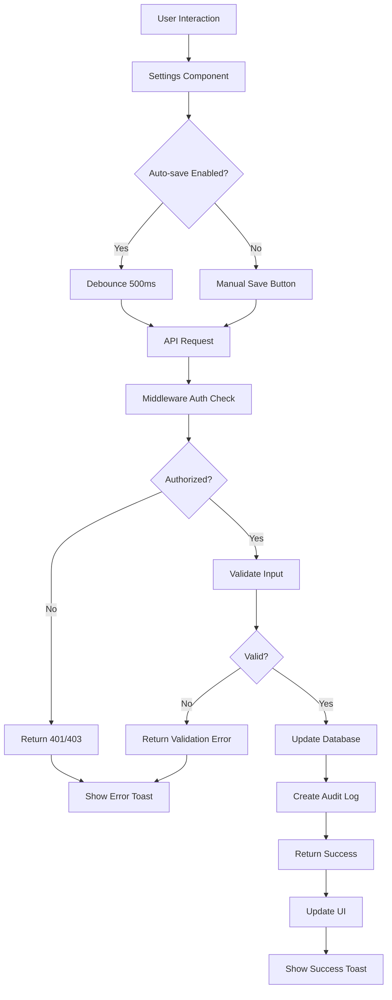

# Design Document

## Overview

The Settings Interface is a comprehensive, role-based configuration system that enables users to manage their profiles, security preferences, user accounts, system configurations, and application customization. The interface follows a tabbed/sectioned layout pattern with navigation sidebar, providing organized access to different configuration areas based on user permissions.

### Key Design Principles

1. **Role-Based Access Control**: Different sections visible based on user role (ADMIN, MANAGER, SUPERVISOR, DATA_ENTRY, AUDITOR)
2. **Progressive Disclosure**: Show only relevant settings to each user role
3. **Auto-save with Feedback**: Settings save automatically with clear visual feedback
4. **Responsive Design**: Mobile-first approach with adaptive layouts
5. **Accessibility First**: Full keyboard navigation, screen reader support, ARIA compliance
6. **Performance**: Lazy loading of sections, optimistic UI updates, debounced saves

## Architecture

### Component Hierarchy

```
SettingsPage (src/app/[locale]/settings/page.tsx)
├── SettingsLayout (src/components/settings/SettingsLayout.tsx)
│   ├── SettingsNavigation (src/components/settings/SettingsNavigation.tsx)
│   └── SettingsContent (src/components/settings/SettingsContent.tsx)
│       ├── ProfileSettings (src/components/settings/ProfileSettings.tsx)
│       │   ├── AvatarUpload (src/components/settings/AvatarUpload.tsx)
│       │   └── ProfileForm (src/components/settings/ProfileForm.tsx)
│       ├── SecuritySettings (src/components/settings/SecuritySettings.tsx)
│       │   ├── PasswordChangeForm (src/components/settings/PasswordChangeForm.tsx)
│       │   ├── SessionManager (src/components/settings/SessionManager.tsx)
│       │   └── SecurityAuditLog (src/components/settings/SecurityAuditLog.tsx)
│       ├── UserManagement (src/components/settings/UserManagement.tsx)
│       │   ├── UserTable (src/components/settings/UserTable.tsx)
│       │   ├── UserModal (src/components/settings/UserModal.tsx)
│       │   ├── RolePermissionsMatrix (src/components/settings/RolePermissionsMatrix.tsx)
│       │   └── BulkUserActions (src/components/settings/BulkUserActions.tsx)
│       ├── AppearanceSettings (src/components/settings/AppearanceSettings.tsx)
│       │   ├── ThemeSelector (src/components/settings/ThemeSelector.tsx)
│       │   ├── ColorSchemeCustomizer (src/components/settings/ColorSchemeCustomizer.tsx)
│       │   └── UIDensitySelector (src/components/settings/UIDensitySelector.tsx)
│       ├── NotificationSettings (src/components/settings/NotificationSettings.tsx)
│       ├── APISettings (src/components/settings/APISettings.tsx)
│       │   ├── GeminiConfig (src/components/settings/GeminiConfig.tsx)
│       │   └── DatabaseStatus (src/components/settings/DatabaseStatus.tsx)
│       └── SystemPreferences (src/components/settings/SystemPreferences.tsx)
│           ├── CompanyInfo (src/components/settings/CompanyInfo.tsx)
│           ├── InventorySettings (src/components/settings/InventorySettings.tsx)
│           ├── BackupConfig (src/components/settings/BackupConfig.tsx)
│           └── SystemLimits (src/components/settings/SystemLimits.tsx)
```


### Data Flow



### State Management

The settings interface uses React hooks for local state management with the following patterns:

1. **Local Component State**: For UI-specific state (modals, form inputs, loading states)
2. **Server State**: Using SWR or React Query for data fetching and caching
3. **Global Settings Context**: For theme, locale, and UI preferences that affect the entire app
4. **URL State**: For active section/tab navigation

## Components and Interfaces

### 1. SettingsLayout Component

**Purpose**: Main container that provides navigation and content area structure

**Props**:
```typescript
interface SettingsLayoutProps {
  children: React.ReactNode
  activeSection: SettingsSection
  onSectionChange: (section: SettingsSection) => void
}

type SettingsSection = 
  | 'profile' 
  | 'security' 
  | 'users' 
  | 'appearance' 
  | 'notifications' 
  | 'api' 
  | 'system'
```

**Behavior**:
- Renders navigation sidebar (desktop) or accordion (mobile)
- Filters visible sections based on user role
- Manages active section state
- Provides search functionality across all settings


### 2. ProfileSettings Component

**Purpose**: Manages user profile information and avatar

**Props**:
```typescript
interface ProfileSettingsProps {
  user: UserProfile
  onUpdate: (data: Partial<UserProfile>) => Promise<void>
}

interface UserProfile {
  id: string
  name: string
  email: string
  role: UserRole
  avatar?: string
  employeeId?: string
  department?: string
  phoneNumber?: string
  workLocation?: string
}
```

**Features**:
- Avatar upload with crop/resize (using react-image-crop or similar)
- Form validation with real-time feedback
- Auto-save with debounce
- Read-only fields for email and role
- Success/error toast notifications

**Validation Rules**:
- Name: 2-100 characters, required
- Phone: Optional, E.164 format validation
- Employee ID: Optional, alphanumeric
- Avatar: Max 5MB, formats: jpg, png, webp

### 3. SecuritySettings Component

**Purpose**: Password management and session control

**Sub-components**:

#### PasswordChangeForm
```typescript
interface PasswordChangeFormProps {
  onSubmit: (data: PasswordChangeData) => Promise<void>
}

interface PasswordChangeData {
  currentPassword: string
  newPassword: string
  confirmPassword: string
}
```

**Features**:
- Password strength indicator (using zxcvbn or similar)
- Show/hide password toggles
- Real-time validation
- Password requirements display

**Password Requirements**:
- Minimum 8 characters
- At least 1 uppercase letter
- At least 1 number
- At least 1 special character

#### SessionManager
```typescript
interface SessionManagerProps {
  sessions: UserSession[]
  currentSessionId: string
  onTerminate: (sessionId: string) => Promise<void>
  onTerminateAll: () => Promise<void>
}

interface UserSession {
  id: string
  device: string
  browser: string
  ipAddress: string
  location?: string
  lastActive: Date
  isCurrent: boolean
}
```

**Features**:
- List all active sessions
- Highlight current session
- Individual session termination
- Bulk termination (all except current)
- Device/browser detection using user-agent parsing


#### SecurityAuditLog
```typescript
interface SecurityAuditLogProps {
  userId: string
  onExport: () => Promise<void>
}

interface SecurityEvent {
  id: string
  type: 'login' | 'failed_login' | 'password_change' | 'session_terminated'
  timestamp: Date
  ipAddress: string
  location?: string
  success: boolean
}
```

**Features**:
- Display last 10 security events
- Filter by event type
- Export to CSV/JSON
- Pagination for full history

### 4. UserManagement Component

**Purpose**: Admin-only user account management

**Access Control**: Only visible to users with ADMIN role

**Sub-components**:

#### UserTable
```typescript
interface UserTableProps {
  users: UserWithStatus[]
  selectedUsers: string[]
  onSelect: (userIds: string[]) => void
  onEdit: (user: UserWithStatus) => void
  onDelete: (userId: string) => void
  onToggleStatus: (userId: string, active: boolean) => void
}

interface UserWithStatus extends User {
  lastLogin?: Date
  isActive: boolean
  sessionCount: number
}
```

**Features**:
- Sortable columns (name, email, role, last login)
- Search by name or email
- Filter by role
- Bulk selection with checkboxes
- Pagination (25 per page)
- Status toggle (active/inactive)
- Prevent self-modification

#### UserModal
```typescript
interface UserModalProps {
  user?: UserWithStatus // undefined for create, defined for edit
  isOpen: boolean
  onClose: () => void
  onSubmit: (data: UserFormData) => Promise<void>
}

interface UserFormData {
  name: string
  email: string
  password?: string
  role: UserRole
  isActive: boolean
  sendWelcomeEmail: boolean
}
```

**Features**:
- Create/edit mode
- Auto-generate password with copy button
- Email uniqueness validation
- Role dropdown with descriptions
- Welcome email toggle
- Form validation


#### RolePermissionsMatrix
```typescript
interface RolePermissionsMatrixProps {
  roles: UserRole[]
  permissions: Permission[]
}

interface Permission {
  id: string
  name: string
  description: string
  category: string
}
```

**Display Matrix**:
```
| Permission          | ADMIN | SUPERVISOR | MANAGER | DATA_ENTRY | AUDITOR |
|---------------------|-------|------------|---------|------------|---------|
| Add Inventory       |   ✓   |     ✓      |    ✗    |     ✓      |    ✗    |
| Edit Inventory      |   ✓   |     ✓      |    ✗    |     ✓      |    ✗    |
| Delete Inventory    |   ✓   |     ✓      |    ✗    |     ✗      |    ✗    |
| View Analytics      |   ✓   |     ✓      |    ✓    |     ✗      |    ✓    |
| Generate Reports    |   ✓   |     ✓      |    ✓    |     ✗      |    ✗    |
| Manage Users        |   ✓   |     ✗      |    ✗    |     ✗      |    ✗    |
| System Settings     |   ✓   |     ✗      |    ✗    |     ✗      |    ✗    |
| View Audit Logs     |   ✓   |     ✓      |    ✗    |     ✗      |    ✓    |
| Export Data         |   ✓   |     ✓      |    ✓    |     ✗      |    ✓    |
```

#### BulkUserActions
```typescript
interface BulkUserActionsProps {
  selectedUsers: string[]
  currentUserId: string
  onActivate: (userIds: string[]) => Promise<void>
  onDeactivate: (userIds: string[]) => Promise<void>
  onChangeRole: (userIds: string[], role: UserRole) => Promise<void>
  onDelete: (userIds: string[]) => Promise<void>
}
```

**Features**:
- Bulk activate/deactivate
- Bulk role change
- Bulk delete with confirmation
- Prevent operations on current user
- Show operation summary (success/failed counts)

### 5. AppearanceSettings Component

**Purpose**: UI customization and theme management

**Sub-components**:

#### ThemeSelector
```typescript
interface ThemeSelectorProps {
  currentTheme: ThemeMode
  onChange: (theme: ThemeMode) => void
}

type ThemeMode = 'light' | 'dark' | 'system'
```

**Features**:
- Radio buttons with preview cards
- Live theme switching
- Smooth transitions
- System preference detection
- Persist to localStorage and user preferences


#### ColorSchemeCustomizer
```typescript
interface ColorSchemeCustomizerProps {
  primaryColor: string
  accentColor: string
  onChange: (colors: ColorScheme) => void
  onReset: () => void
}

interface ColorScheme {
  primary: string
  accent: string
}
```

**Features**:
- Color picker for primary and accent colors
- Preset color schemes (Default, Blue, Green, Purple, Red)
- Live preview
- Reset to default
- CSS variable updates

#### UIDensitySelector
```typescript
interface UIDensitySelectorProps {
  density: UIDensity
  fontSize: number
  onChange: (settings: UISettings) => void
}

type UIDensity = 'compact' | 'comfortable' | 'spacious'

interface UISettings {
  density: UIDensity
  fontSize: number
}
```

**Features**:
- Radio buttons for density selection
- Font size slider (12-20px)
- Live preview text
- Apply globally via CSS variables

**CSS Variables**:
```css
:root {
  --spacing-unit: 4px; /* compact */
  --spacing-unit: 8px; /* comfortable */
  --spacing-unit: 12px; /* spacious */
  --font-size-base: 16px; /* adjustable */
}
```

### 6. NotificationSettings Component

**Purpose**: Configure notification preferences

```typescript
interface NotificationSettingsProps {
  preferences: NotificationPreferences
  onChange: (prefs: Partial<NotificationPreferences>) => Promise<void>
  onTest: () => Promise<void>
}

interface NotificationPreferences {
  email: EmailNotifications
  inApp: InAppNotifications
  frequency: NotificationFrequency
}

interface EmailNotifications {
  dailyInventorySummary: boolean
  weeklyAnalyticsReport: boolean
  newUserRegistration: boolean // Admin only
  highRejectRateAlert: boolean
  systemUpdates: boolean
  backupStatus: boolean
}

interface InAppNotifications {
  enabled: boolean
  sound: boolean
  desktop: boolean
}

type NotificationFrequency = 'realtime' | 'hourly' | 'daily' | 'custom'
```

**Features**:
- Checkbox groups for email notifications
- Browser notification permission request
- Test notification button
- Frequency selector
- Role-based visibility (e.g., newUserRegistration for ADMIN only)


### 7. APISettings Component

**Purpose**: Configure external API integrations (Admin only)

**Access Control**: Only visible to ADMIN role

**Sub-components**:

#### GeminiConfig
```typescript
interface GeminiConfigProps {
  config: GeminiConfiguration
  onUpdate: (config: Partial<GeminiConfiguration>) => Promise<void>
  onValidate: () => Promise<ValidationResult>
}

interface GeminiConfiguration {
  apiKey: string
  model: string
  temperature: number
  maxTokens: number
  cacheInsightsDuration: number
  features: AIFeatures
  usage?: UsageStats
}

interface AIFeatures {
  insights: boolean
  predictiveAnalytics: boolean
  naturalLanguageQueries: boolean
}

interface UsageStats {
  requestsThisMonth: number
  tokensConsumed: number
  rateLimit: {
    limit: number
    remaining: number
    resetAt: Date
  }
}

interface ValidationResult {
  valid: boolean
  message: string
  lastValidated?: Date
}
```

**Features**:
- Masked API key display (show last 4 chars)
- API key update with show/hide toggle
- Validate button to test connection
- Model selection dropdown
- Temperature slider (0-1)
- Max tokens input
- Cache duration input
- Feature toggles
- Usage statistics display

#### DatabaseStatus
```typescript
interface DatabaseStatusProps {
  status: DatabaseInfo
}

interface DatabaseInfo {
  type: string
  connected: boolean
  lastMigration?: Date
  size: string
  lastBackup?: Date
  backupStatus: 'success' | 'failed' | 'pending'
}
```

**Features**:
- Read-only display
- Connection status indicator (green/red)
- Database metrics
- Last migration timestamp
- Backup status


### 8. SystemPreferences Component

**Purpose**: System-wide configuration (Admin and Manager)

**Access Control**: Visible to ADMIN and MANAGER roles

**Sub-components**:

#### CompanyInfo
```typescript
interface CompanyInfoProps {
  info: CompanyInformation
  onUpdate: (info: Partial<CompanyInformation>) => Promise<void>
}

interface CompanyInformation {
  name: string
  logo?: string
  fiscalYearStart: number // 1-12 (month)
  timezone: string
}
```

**Features**:
- Company name input
- Logo upload (used in PDFs and headers)
- Fiscal year start month selector
- Timezone dropdown (using Intl.supportedValuesOf('timeZone'))

#### InventorySettings
```typescript
interface InventorySettingsProps {
  settings: InventoryConfiguration
  onUpdate: (settings: Partial<InventoryConfiguration>) => Promise<void>
}

interface InventoryConfiguration {
  defaultDestination: Destination | null
  categoriesEnabled: boolean
  predefinedCategories: string[]
  autoBatchNumbers: boolean
  batchNumberPattern?: string
  supervisorApproval: boolean
  approvalThreshold?: number
}
```

**Features**:
- Default destination dropdown
- Categories toggle
- Tag input for predefined categories
- Auto-generate batch numbers toggle
- Batch number pattern input (e.g., "BATCH-{YYYY}-{####}")
- Supervisor approval toggle
- Approval threshold input (for high-value items)

#### BackupConfig
```typescript
interface BackupConfigProps {
  config: BackupConfiguration
  onUpdate: (config: Partial<BackupConfiguration>) => Promise<void>
}

interface BackupConfiguration {
  enabled: boolean
  time: string // HH:mm format
  retentionDays: number
  format: BackupFormat[]
}

type BackupFormat = 'CSV' | 'JSON' | 'SQL'
```

**Features**:
- Enable daily backups toggle
- Time picker for backup schedule
- Retention period input (days)
- Format checkboxes (CSV, JSON, both)
- Last backup status display


#### SystemLimits
```typescript
interface SystemLimitsProps {
  limits: SystemLimitsConfiguration
  onUpdate: (limits: Partial<SystemLimitsConfiguration>) => Promise<void>
}

interface SystemLimitsConfiguration {
  maxItemsPerUserPerDay: number
  maxFileUploadSizeMB: number
  sessionTimeoutMinutes: number
  maxLoginAttempts: number
  rateLimitPerMinute: number
}
```

**Features**:
- Input fields for each limit
- Validation for acceptable ranges
- Real-time validation feedback
- Apply immediately on save

**Validation Ranges**:
- maxItemsPerUserPerDay: 1-10000
- maxFileUploadSizeMB: 1-100
- sessionTimeoutMinutes: 5-1440
- maxLoginAttempts: 1-10
- rateLimitPerMinute: 10-1000

#### DeveloperSettings (Admin only)
```typescript
interface DeveloperSettingsProps {
  settings: DeveloperConfiguration
  onUpdate: (settings: Partial<DeveloperConfiguration>) => Promise<void>
  onExportLogs: () => Promise<void>
}

interface DeveloperConfiguration {
  debugMode: boolean
  logLevel: LogLevel
  apiRateLimits: {
    perMinute: number
    perHour: number
  }
}

type LogLevel = 'error' | 'warning' | 'info' | 'debug'
```

**Features**:
- Debug mode toggle
- Log level selector
- API rate limit inputs
- Export system logs button

## Data Models

### User Preferences Extension

Extend the existing User model's `preferences` JSON field:

```typescript
interface UserPreferences {
  theme: ThemeMode
  uiDensity: UIDensity
  fontSize: number
  colorScheme?: ColorScheme
  notifications: NotificationPreferences
  sidebarCollapsed: boolean
  sidebarPosition: 'left' | 'right'
  showBreadcrumbs: boolean
}
```

### System Settings Model

Already exists in Prisma schema. Settings are stored as key-value pairs:

```typescript
// Example settings keys
const SETTING_KEYS = {
  // Company
  COMPANY_NAME: 'company_name',
  COMPANY_LOGO: 'company_logo',
  FISCAL_YEAR_START: 'fiscal_year_start',
  TIMEZONE: 'timezone',
  
  // Inventory
  DEFAULT_DESTINATION: 'default_destination',
  CATEGORIES_ENABLED: 'categories_enabled',
  PREDEFINED_CATEGORIES: 'predefined_categories',
  AUTO_BATCH_NUMBERS: 'auto_batch_numbers',
  BATCH_NUMBER_PATTERN: 'batch_number_pattern',
  SUPERVISOR_APPROVAL: 'supervisor_approval',
  APPROVAL_THRESHOLD: 'approval_threshold',
  
  // Backup
  BACKUP_ENABLED: 'backup_enabled',
  BACKUP_TIME: 'backup_time',
  BACKUP_RETENTION_DAYS: 'backup_retention_days',
  BACKUP_FORMAT: 'backup_format',
  
  // System Limits
  MAX_ITEMS_PER_USER_PER_DAY: 'max_items_per_user_per_day',
  MAX_FILE_UPLOAD_SIZE_MB: 'max_file_upload_size_mb',
  SESSION_TIMEOUT_MINUTES: 'session_timeout_minutes',
  MAX_LOGIN_ATTEMPTS: 'max_login_attempts',
  RATE_LIMIT_PER_MINUTE: 'rate_limit_per_minute',
  
  // API
  GEMINI_API_KEY: 'gemini_api_key',
  GEMINI_MODEL: 'gemini_model',
  GEMINI_TEMPERATURE: 'gemini_temperature',
  GEMINI_MAX_TOKENS: 'gemini_max_tokens',
  GEMINI_CACHE_DURATION: 'gemini_cache_duration',
  AI_INSIGHTS_ENABLED: 'ai_insights_enabled',
  AI_PREDICTIVE_ENABLED: 'ai_predictive_enabled',
  AI_NLQ_ENABLED: 'ai_nlq_enabled',
  
  // Developer
  DEBUG_MODE: 'debug_mode',
  LOG_LEVEL: 'log_level',
}
```


### Session Model Extension

Add session tracking for the SessionManager component:

```typescript
// Extend existing Session model with additional fields
interface ExtendedSession {
  id: string
  sessionToken: string
  userId: string
  expires: Date
  // New fields
  device?: string
  browser?: string
  os?: string
  ipAddress?: string
  location?: string
  lastActive: Date
  createdAt: Date
}
```

## API Endpoints

### Profile Management

#### GET /api/users/profile
- **Auth**: Required
- **Returns**: Current user profile with preferences
- **Requirements**: 2.1, 2.2, 2.3

#### PATCH /api/users/profile
- **Auth**: Required
- **Body**: Partial<UserProfile>
- **Returns**: Updated profile
- **Requirements**: 2.5, 2.6

#### POST /api/users/avatar
- **Auth**: Required
- **Body**: FormData with image file
- **Returns**: Avatar URL
- **Requirements**: 3.2, 3.4, 3.5

#### DELETE /api/users/avatar
- **Auth**: Required
- **Returns**: Success message
- **Requirements**: 3.4

### Security Management

#### POST /api/auth/change-password
- **Auth**: Required
- **Body**: PasswordChangeData
- **Returns**: Success message
- **Requirements**: 4.5, 4.6

#### GET /api/auth/sessions
- **Auth**: Required
- **Returns**: List of active sessions
- **Requirements**: 5.1, 5.2, 5.3

#### DELETE /api/auth/sessions/:id
- **Auth**: Required
- **Returns**: Success message
- **Requirements**: 5.4

#### DELETE /api/auth/sessions/all
- **Auth**: Required
- **Returns**: Success message
- **Requirements**: 5.5

#### GET /api/auth/security-log
- **Auth**: Required
- **Query**: page, limit
- **Returns**: Paginated security events
- **Requirements**: 6.1, 6.2, 6.3

#### GET /api/auth/security-log/export
- **Auth**: Required
- **Returns**: CSV/JSON file
- **Requirements**: 6.5

### User Management

#### GET /api/users
- **Auth**: Required (ADMIN only)
- **Query**: search, role, page, limit
- **Returns**: Paginated user list
- **Requirements**: 7.3, 7.4, 7.5

#### POST /api/users
- **Auth**: Required (ADMIN only)
- **Body**: UserFormData
- **Returns**: Created user
- **Requirements**: 8.2, 8.3, 8.4, 8.5

#### PUT /api/users/:id
- **Auth**: Required (ADMIN only)
- **Body**: Partial<UserFormData>
- **Returns**: Updated user
- **Requirements**: 8.6

#### PATCH /api/users/:id/status
- **Auth**: Required (ADMIN only)
- **Body**: { isActive: boolean }
- **Returns**: Updated user
- **Requirements**: 9.2, 9.3, 9.4

#### POST /api/users/bulk-action
- **Auth**: Required (ADMIN only)
- **Body**: { action: string, userIds: string[], data?: any }
- **Returns**: Operation summary
- **Requirements**: 10.2, 10.3, 10.4, 10.5


### Preferences Management

#### GET /api/users/preferences
- **Auth**: Required
- **Returns**: User preferences object
- **Requirements**: 12.4, 13.4

#### PATCH /api/users/preferences
- **Auth**: Required
- **Body**: Partial<UserPreferences>
- **Returns**: Updated preferences
- **Requirements**: 12.2, 12.3, 13.2, 13.3, 21.1, 21.2, 21.3

### Notification Settings

#### GET /api/users/notifications
- **Auth**: Required
- **Returns**: Notification preferences
- **Requirements**: 14.1, 14.2, 14.3, 14.4

#### PATCH /api/users/notifications
- **Auth**: Required
- **Body**: Partial<NotificationPreferences>
- **Returns**: Updated preferences
- **Requirements**: 14.1, 14.2, 14.3, 14.4

#### POST /api/users/notifications/test
- **Auth**: Required
- **Returns**: Success message
- **Requirements**: 14.5

### System Settings

#### GET /api/settings
- **Auth**: Required (ADMIN/MANAGER for system settings)
- **Returns**: System settings grouped by category
- **Requirements**: 15.2, 17.2, 17.3, 17.4, 17.5

#### PATCH /api/settings
- **Auth**: Required (ADMIN only)
- **Body**: { settings: Array<{ key: string, value: any }> }
- **Returns**: Updated settings
- **Requirements**: 15.3, 15.4, 15.5, 18.2, 18.3, 18.4, 18.5, 19.2, 19.3, 19.4, 19.5

### API Configuration

#### POST /api/settings/gemini/validate
- **Auth**: Required (ADMIN only)
- **Body**: { apiKey: string }
- **Returns**: Validation result with usage stats
- **Requirements**: 15.3, 15.4

#### GET /api/settings/database/status
- **Auth**: Required (ADMIN only)
- **Returns**: Database connection and health info
- **Requirements**: 24.2, 24.3, 24.4, 24.5

### Developer Tools

#### GET /api/settings/logs/export
- **Auth**: Required (ADMIN only)
- **Returns**: System logs file
- **Requirements**: 25.5

## Error Handling

### Validation Errors

All form inputs should have client-side validation with immediate feedback. Server-side validation errors should be displayed inline next to the relevant field.

```typescript
interface ValidationError {
  field: string
  message: string
  code: string
}

interface ApiErrorResponse {
  success: false
  error: {
    code: ErrorCode
    message: string
    details?: ValidationError[]
  }
}
```

### Error States

1. **Network Errors**: Show toast notification with retry option
2. **Authentication Errors**: Redirect to login
3. **Permission Errors**: Show inline message explaining required role
4. **Validation Errors**: Show inline field errors
5. **Server Errors**: Show toast with error message and support contact

### Error Recovery

- Auto-retry failed requests (max 3 attempts with exponential backoff)
- Preserve form state on errors
- Provide clear error messages with actionable steps
- Log errors to monitoring service (Sentry, LogRocket, etc.)


## Testing Strategy

### Unit Tests

Test individual components in isolation:

1. **Form Components**
   - Validation logic
   - Input handling
   - Error display
   - Submit behavior

2. **Utility Functions**
   - Password strength calculation
   - User-agent parsing
   - Date formatting
   - Validation helpers

3. **Hooks**
   - useSettings hook
   - useAutoSave hook
   - useDebounce hook

### Integration Tests

Test component interactions:

1. **Settings Flow**
   - Navigate between sections
   - Update settings and verify persistence
   - Role-based visibility
   - Search functionality

2. **User Management Flow**
   - Create user
   - Edit user
   - Delete user
   - Bulk operations

3. **Security Flow**
   - Change password
   - Manage sessions
   - View audit log

### E2E Tests

Test complete user workflows:

1. **Admin User Journey**
   - Login as admin
   - Navigate to settings
   - Create new user
   - Configure system settings
   - Verify changes persist

2. **Regular User Journey**
   - Login as data entry user
   - Update profile
   - Change password
   - Customize appearance
   - Verify limited access

### Accessibility Tests

1. **Keyboard Navigation**
   - Tab through all interactive elements
   - Activate buttons with Enter/Space
   - Navigate sections with arrow keys

2. **Screen Reader**
   - Test with NVDA/JAWS
   - Verify ARIA labels
   - Check announcements

3. **Visual**
   - Test with high contrast mode
   - Verify color contrast ratios (WCAG AA)
   - Test with different font sizes

### Performance Tests

1. **Load Time**
   - Measure initial page load
   - Lazy loading effectiveness
   - Bundle size analysis

2. **Interaction Performance**
   - Debounce effectiveness
   - Auto-save performance
   - Search responsiveness

3. **Memory Usage**
   - Check for memory leaks
   - Monitor component re-renders
   - Optimize large lists

## Security Considerations

### Authentication & Authorization

1. **Session Management**
   - Secure session tokens
   - HTTP-only cookies
   - CSRF protection
   - Session timeout enforcement

2. **Role-Based Access**
   - Server-side permission checks
   - Client-side UI hiding (not security)
   - Audit all permission changes

### Data Protection

1. **Sensitive Data**
   - Mask API keys (show last 4 chars)
   - Never log passwords
   - Encrypt sensitive settings at rest
   - Use HTTPS for all requests

2. **Input Validation**
   - Sanitize all user inputs
   - Validate file uploads
   - Prevent XSS attacks
   - SQL injection prevention (using Prisma)

3. **Rate Limiting**
   - Limit password change attempts
   - Limit API key validation attempts
   - Limit bulk operations

### Audit Logging

Log all security-relevant actions:
- User creation/deletion
- Role changes
- Password changes
- Settings modifications
- Failed login attempts
- Session terminations


## Mobile Responsive Design

### Breakpoints

```css
/* Mobile: < 768px */
@media (max-width: 767px) {
  /* Accordion navigation */
  /* Full-width forms */
  /* Stacked layouts */
}

/* Tablet: 768px - 1023px */
@media (min-width: 768px) and (max-width: 1023px) {
  /* Sidebar navigation (collapsible) */
  /* Two-column forms */
}

/* Desktop: >= 1024px */
@media (min-width: 1024px) {
  /* Sidebar navigation (always visible) */
  /* Multi-column layouts */
}
```

### Mobile Adaptations

1. **Navigation**
   - Tabs → Accordion on mobile
   - Sticky section headers
   - Swipe gestures between sections

2. **Forms**
   - Full-width inputs
   - Larger touch targets (min 44x44px)
   - Native mobile inputs (date, time, color)
   - Sticky save buttons

3. **Tables**
   - Card layout for user list
   - Horizontal scroll with shadow indicators
   - Simplified columns

4. **Modals**
   - Full-screen on mobile
   - Slide-up animation
   - Easy dismiss gestures

## Accessibility Features

### Keyboard Navigation

1. **Tab Order**
   - Logical tab sequence
   - Skip links to main content
   - Focus visible indicators

2. **Keyboard Shortcuts**
   - `Ctrl/Cmd + S`: Save current section
   - `Ctrl/Cmd + K`: Focus search
   - `Esc`: Close modals
   - Arrow keys: Navigate sections

### Screen Reader Support

1. **ARIA Labels**
   - Descriptive labels for all inputs
   - Role attributes for custom components
   - Live regions for dynamic content

2. **Announcements**
   - Success/error messages
   - Loading states
   - Form validation errors

### Visual Accessibility

1. **Color Contrast**
   - WCAG AA compliance (4.5:1 for text)
   - High contrast theme option
   - Don't rely on color alone

2. **Focus Indicators**
   - Visible focus rings
   - High contrast focus styles
   - Skip link visibility

3. **Text Scaling**
   - Support up to 200% zoom
   - Responsive font sizes
   - No horizontal scrolling

## Performance Optimizations

### Code Splitting

```typescript
// Lazy load settings sections
const ProfileSettings = lazy(() => import('./ProfileSettings'))
const SecuritySettings = lazy(() => import('./SecuritySettings'))
const UserManagement = lazy(() => import('./UserManagement'))
const AppearanceSettings = lazy(() => import('./AppearanceSettings'))
const NotificationSettings = lazy(() => import('./NotificationSettings'))
const APISettings = lazy(() => import('./APISettings'))
const SystemPreferences = lazy(() => import('./SystemPreferences'))
```

### Data Fetching

1. **SWR/React Query**
   - Cache settings data
   - Revalidate on focus
   - Optimistic updates
   - Background refetch

2. **Debouncing**
   - Auto-save with 500ms debounce
   - Search with 300ms debounce
   - Validation with 200ms debounce

### Rendering Optimizations

1. **Memoization**
   - Memo expensive components
   - useMemo for computed values
   - useCallback for event handlers

2. **Virtual Scrolling**
   - User list (if > 100 users)
   - Audit log entries
   - Session list

## Internationalization (i18n)

### Translation Keys

```typescript
// en.json
{
  "settings": {
    "title": "Settings",
    "profile": "Profile",
    "security": "Security",
    "users": "User Management",
    "appearance": "Appearance",
    "notifications": "Notifications",
    "api": "API & Integrations",
    "system": "System Preferences",
    
    "profile": {
      "title": "Profile Settings",
      "avatar": "Profile Picture",
      "name": "Full Name",
      "email": "Email Address",
      "role": "Role",
      "employeeId": "Employee ID",
      "department": "Department",
      "phone": "Phone Number",
      "location": "Work Location",
      "save": "Save Changes"
    },
    
    "security": {
      "title": "Security Settings",
      "changePassword": "Change Password",
      "currentPassword": "Current Password",
      "newPassword": "New Password",
      "confirmPassword": "Confirm Password",
      "passwordRequirements": "Password Requirements",
      "sessions": "Active Sessions",
      "currentSession": "Current Session",
      "signOut": "Sign Out",
      "signOutAll": "Sign Out All Other Sessions",
      "auditLog": "Security Audit Log"
    }
    
    // ... more translations
  }
}
```

### RTL Support

For Arabic locale:
- Mirror layout direction
- Flip icons and arrows
- Adjust text alignment
- Test all components in RTL mode


## Implementation Notes

### Third-Party Libraries

1. **Form Management**
   - react-hook-form: Form state and validation
   - zod: Schema validation

2. **Image Handling**
   - react-image-crop: Avatar cropping
   - sharp (server-side): Image resizing

3. **UI Components**
   - Existing UI components from src/components/ui
   - headlessui: Accessible components (if needed)

4. **Utilities**
   - date-fns: Date formatting
   - ua-parser-js: User-agent parsing
   - zxcvbn: Password strength
   - nanoid: Generate passwords

5. **Data Fetching**
   - SWR or @tanstack/react-query: Server state management

### File Structure

```
src/
├── app/
│   └── [locale]/
│       └── settings/
│           └── page.tsx (Main settings page)
├── components/
│   └── settings/
│       ├── SettingsLayout.tsx
│       ├── SettingsNavigation.tsx
│       ├── SettingsSearch.tsx
│       ├── ProfileSettings.tsx
│       ├── AvatarUpload.tsx
│       ├── ProfileForm.tsx
│       ├── SecuritySettings.tsx
│       ├── PasswordChangeForm.tsx
│       ├── PasswordStrengthIndicator.tsx
│       ├── SessionManager.tsx
│       ├── SessionCard.tsx
│       ├── SecurityAuditLog.tsx
│       ├── UserManagement.tsx
│       ├── UserTable.tsx
│       ├── UserModal.tsx
│       ├── RolePermissionsMatrix.tsx
│       ├── BulkUserActions.tsx
│       ├── AppearanceSettings.tsx
│       ├── ThemeSelector.tsx
│       ├── ColorSchemeCustomizer.tsx
│       ├── UIDensitySelector.tsx
│       ├── NotificationSettings.tsx
│       ├── APISettings.tsx
│       ├── GeminiConfig.tsx
│       ├── DatabaseStatus.tsx
│       ├── SystemPreferences.tsx
│       ├── CompanyInfo.tsx
│       ├── InventorySettings.tsx
│       ├── BackupConfig.tsx
│       ├── SystemLimits.tsx
│       ├── DeveloperSettings.tsx
│       └── index.ts
├── hooks/
│   ├── useSettings.ts
│   ├── useAutoSave.ts
│   ├── useDebounce.ts
│   └── useUserPreferences.ts
├── app/api/
│   ├── users/
│   │   ├── profile/
│   │   │   └── route.ts
│   │   ├── avatar/
│   │   │   └── route.ts
│   │   ├── preferences/
│   │   │   └── route.ts
│   │   ├── notifications/
│   │   │   ├── route.ts
│   │   │   └── test/
│   │   │       └── route.ts
│   │   └── bulk-action/
│   │       └── route.ts
│   ├── auth/
│   │   ├── sessions/
│   │   │   ├── route.ts
│   │   │   ├── [id]/
│   │   │   │   └── route.ts
│   │   │   └── all/
│   │   │       └── route.ts
│   │   └── security-log/
│   │       ├── route.ts
│   │       └── export/
│   │           └── route.ts
│   └── settings/
│       ├── gemini/
│       │   └── validate/
│       │       └── route.ts
│       ├── database/
│       │   └── status/
│       │       └── route.ts
│       └── logs/
│           └── export/
│               └── route.ts
└── utils/
    ├── password.ts (strength calculation)
    ├── user-agent.ts (parsing)
    └── settings-validation.ts
```

### Database Migrations

No new tables required. Extend existing models:

1. **User.preferences**: Store user-specific settings (theme, UI preferences)
2. **SystemSettings**: Already exists for system-wide settings
3. **Session**: May need to add fields for device/browser tracking
4. **AuditLog**: Already exists for security logging

### Environment Variables

```env
# Existing
DATABASE_URL=
NEXTAUTH_URL=
NEXTAUTH_SECRET=
GEMINI_API_KEY=

# New (optional)
MAX_AVATAR_SIZE_MB=5
SESSION_TRACKING_ENABLED=true
AUDIT_LOG_RETENTION_DAYS=90
```

## Design Decisions & Rationale

### 1. Auto-save vs Manual Save

**Decision**: Use auto-save with debounce for most settings, manual save for critical changes (password, API keys)

**Rationale**:
- Better UX for frequent changes
- Reduces cognitive load
- Manual save for security-sensitive operations
- Clear feedback on save status

### 2. Tabbed vs Accordion Navigation

**Decision**: Tabs on desktop, accordion on mobile

**Rationale**:
- Tabs provide better overview on desktop
- Accordion saves vertical space on mobile
- Consistent with mobile design patterns

### 3. Role-Based UI Hiding

**Decision**: Hide sections client-side, enforce permissions server-side

**Rationale**:
- Cleaner UI for users
- Reduces confusion
- Server-side enforcement is security boundary
- Client-side hiding is UX enhancement

### 4. Settings Storage

**Decision**: User preferences in User.preferences JSON, system settings in SystemSettings table

**Rationale**:
- User preferences are user-specific
- System settings affect all users
- Separate concerns
- Easy to query and update

### 5. Session Tracking

**Decision**: Track device, browser, IP, location for sessions

**Rationale**:
- Security visibility
- Detect suspicious activity
- User awareness
- Compliance requirements

## Future Enhancements

1. **Two-Factor Authentication**
   - TOTP support
   - Backup codes
   - SMS verification

2. **Advanced Permissions**
   - Custom roles
   - Granular permissions
   - Permission inheritance

3. **Settings Import/Export**
   - Export user preferences
   - Import settings from file
   - Settings templates

4. **Activity Dashboard**
   - User activity heatmap
   - Settings change history
   - Usage analytics

5. **Webhooks**
   - Configure webhooks for events
   - Test webhook endpoints
   - Webhook logs

6. **Email Templates**
   - Customize notification emails
   - Preview email templates
   - Multi-language support

7. **Advanced Backup**
   - Incremental backups
   - Cloud storage integration
   - Automated restore testing

8. **Compliance Features**
   - GDPR data export
   - Data retention policies
   - Consent management
